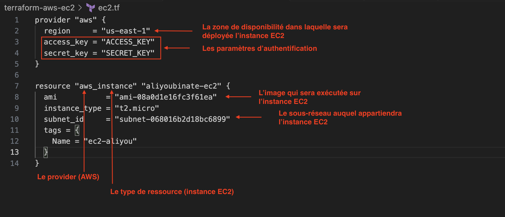
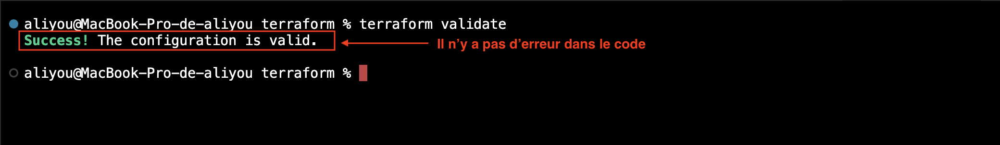
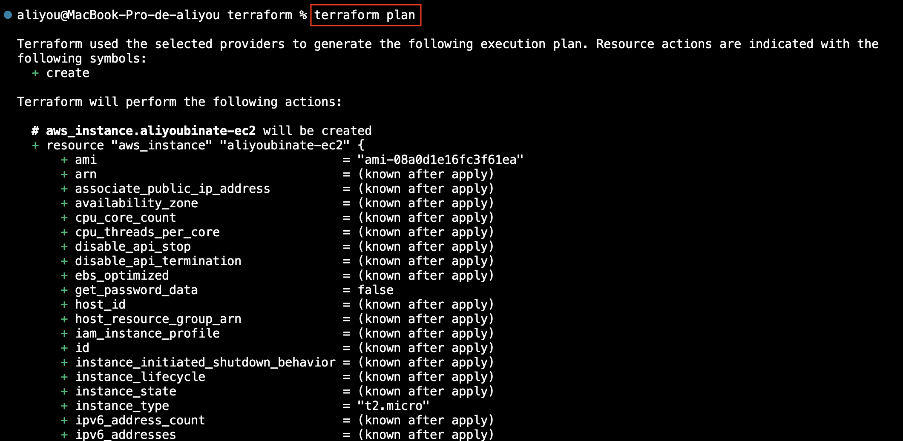
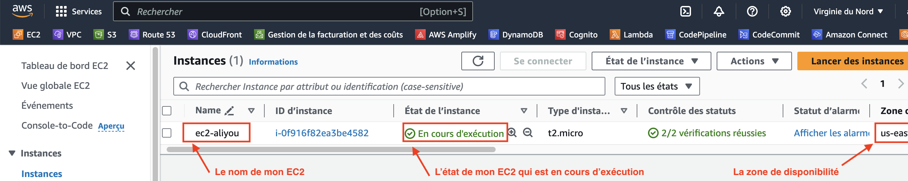
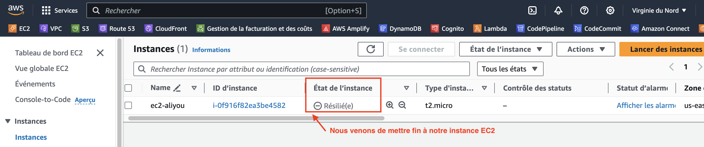

## Mise en place d'une instance AWS (EC2) par Terraform

### Code de déploiement de l'insfrastructure


### Vérification du code 
La commande :
```
terraform validate
```
nous permettra de vérifier s'il y a ou non des erreurs dans le code tf


### Visualisons le plan d'exécution
Cela se fait par la commande suivante : 

```
terraform plan
```
Terraform nous fait la liste de toutes les intégrations qui seront mises en oeurvre pour la mise en place de l'instance EC2



### Déploiement de l'instance EC2
 Le déploiement de l'insfrastructure se fait par la commande suivante :

 ```
terraform apply
```
remarque: Une étape de confirmation sera presentée, pour savoir si les éventuelles modifications apportées au code doivent être prise en compte ou non avant le déploiement.
On pourra rajouter l'option « --auto-approve », pour approuver automatiquement, ce qui nous épargnera cette étape de confirmation.
<br />
Mais il faut éviter l'option « --auto-approve » en production.
<br /><br />



### Destruction de l'instance EC2
Les bonnes habitudes à avoir lorsqu'on travaille dans le cloud, est de détruire les ressources non indispensables. L'on pourra toujours les recréer au besoin, d'où l'importance de l'infrastructure as code (IAC).
En effet, des ressources sont payantes tant qu'elles existent, autant les détruire si elles ne sont pas nécessaires.
<br />
La commande pour détruire l'instance EC2 que nous venons de mettre en place est la suivante : 
 ```
terraform destroy
```

<br /><br />
